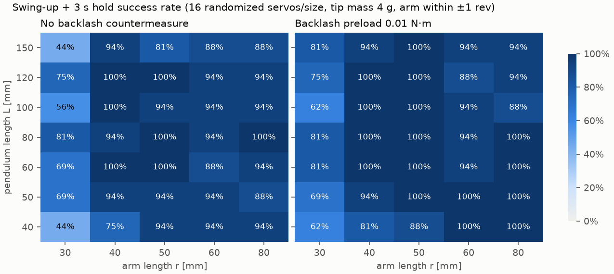
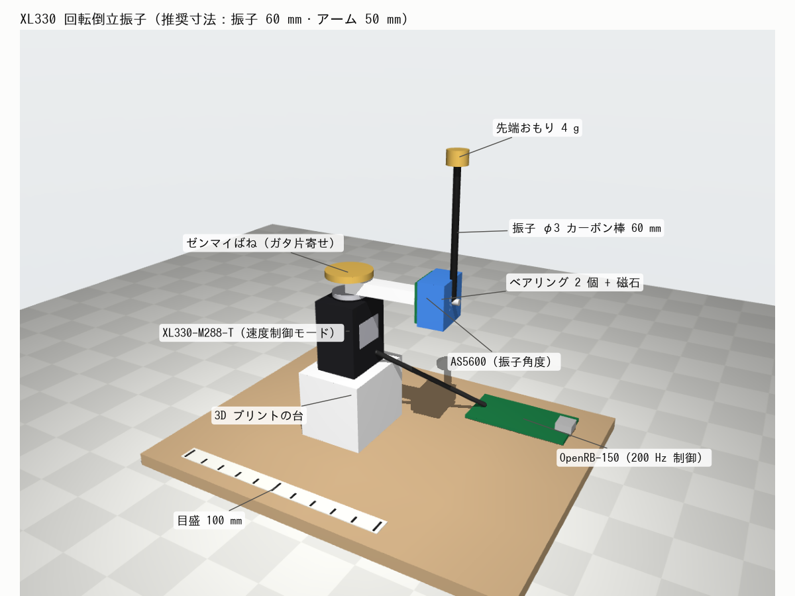
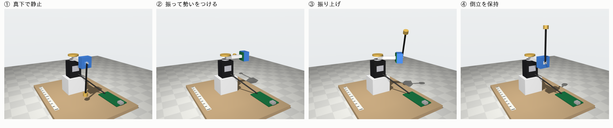
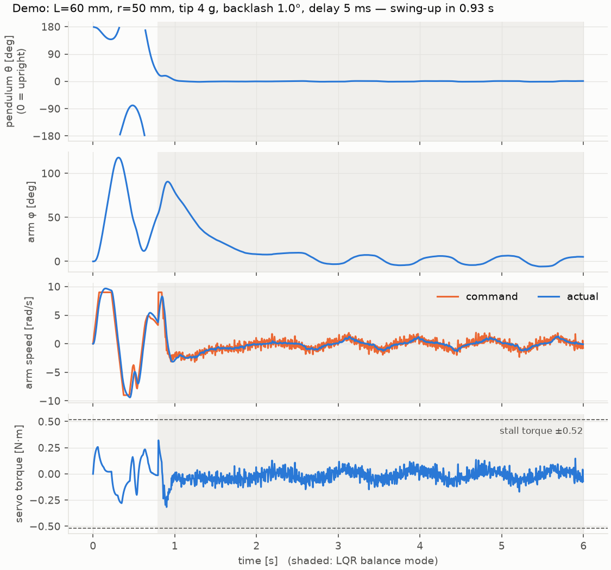
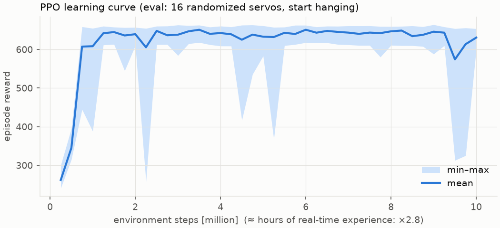

# mujoco_study

MuJoCo で sim2real を学ぶためのリポジトリ。

## furuta: XL330-M288-T で作る小型回転倒立振子の実現性検証

Dynamixel XL330-M288-T 1 個で回転倒立振子（Furuta 振子）を作り、真下からスイングアップして倒立を保てるかを、
部品を買う前にシミュレーションで確かめる。

### 結論

**作れる見込みが高い。推奨寸法は振子 60 mm・アーム 50 mm・先端おもり 4〜8 g**（振子の軸の高さは 70 mm 程度で、装置全体が手のひらに載る大きさ）。

| 条件 | 推奨寸法（L=60, r=50, 4 g）の成功率 |
|---|---|
| 不確かなパラメータを標準的な範囲でランダムに変えた場合 | 100%（16 台中 16 台） |
| 厳しめの条件（サーボ時定数 30〜50 ms、遅延 6〜12 ms、ガタ 1〜2.5°）を公称値の制御器で動かした場合 | 25% |
| 同じ厳しめの条件で、サーボ応答と遅延を同定し直して制御器を設計した場合 | **96%** |

「シミュレーションで公称値のまま作った制御器は実機では動かないが、システム同定すれば動く」という
sim2real の核心が、そのまま数字に出ている。



### 分かったこと（設計指針）

1. **先端おもりは必須**：棒だけの小さな振子（1〜2 g）は重力トルクが小さく、ベアリングの摩擦（1e-5〜1.5e-4 N·m）に負けて倒立中に振動し続ける。
   4〜8 g のおもり（ナットや真鍮片）を付けると、振子 40〜60 mm でも成立する（`results/tip_mass_effect.png`）。
2. **アームは 40 mm 以上**：30 mm ではアームを動かして振子を操る効きが足りず、成功率が下がる。長すぎると配線の制約（アーム ±1 回転）に引っかかりやすくなる。
3. **ギアのガタは「片寄せ」で抑える**：ガタの中でアームが行き来すると小刻みな振動が続き、倒立中もサーボが大きなトルクを出し続けて発熱の原因になる
   （L=80 mm・r=50 mm では倒立中トルクの RMS の 90 パーセンタイルが 0.27 N·m で、停動トルクの約半分）。
   ゼンマイばねなどで**アームに一方向の一定トルク（0.005〜0.01 N·m）をかけ続けて歯を片側に押し付けると、この振動が消え、同じ寸法で 0.11 N·m まで下がる**。
   振子が短いほどこの差は小さい（L=60 mm ではどちらも約 0.10 N·m）。固定フレームとの摩擦（O リングなど）では一部しか効かなかった。
4. **振子の角速度はカルマンフィルタで推定する**：12bit エンコーダの差分だと量子化ノイズが指令に乗り、ギアの大きな慣性を揺さぶってトルクを浪費する。
5. **サーボは速度制御モードで使う**：減速比 288:1 のサーボはトルクで振子を操るのには向かないが、「指令した速度でアームを回す装置」として扱えば
   ステッピングモーター式の Furuta 振子と同じ考え方で制御できる。LQR の設計モデルにサーボの一次遅れと遅延を入れるのが重要。

### 想定したハードウェア




（MuJoCo のレンダリング。台・基板・ばね・センサーは見た目だけの部品で、物理には影響しない。
`MUJOCO_GL=osmesa uv run python -m furuta.render` で再生成できる）

```
        ┌─ 振子：φ3 mm カーボン棒 60 mm + 先端おもり 4〜8 g
        │
  ●━━━━━┥ アーム 50 mm（3D プリント）、先端に
  ┃           ベアリング 2 個 + AS5600 + 径方向着磁の磁石
  ┃
 [XL330-M288-T]（出力軸を上向きに固定、速度制御モード）
  ┃  └ ゼンマイばね等でアームに一方向トルク（ガタ片寄せ）
 [ベース]  OpenRB-150（Dynamixel 通信 + AS5600 を I2C で読む、200 Hz）
```

- 振子の角度センサーはアームと一緒に回るので、配線のためにアームを ±1 回転以内に収める（制御器にアームを中央へ戻す項を入れてある）。
  小型スリップリングを使えばこの制約はなくなる。
- 方策や制御器はマイコン上で 200 Hz で動かす。PC はログ取得と書き込みに使う。

### モデル化したもの

| 要素 | モデル | 範囲（不確かなもの） |
|---|---|---|
| XL330 | 速度 PI ループ + 電圧によるトルク-速度制限（停動 0.52 N·m、無負荷 103 rpm） | 停動トルク −20%、無負荷速度 −15% |
| ギア慣性（回転子慣性 × 減速比²） | 関節の `armature` | 0.7〜4 ×10⁻³ kg·m² |
| ギア摩擦 | `frictionloss` | 0.01〜0.06 N·m |
| サーボ速度ループの時定数 | PI ゲインから設定 | 8〜30 ms |
| ガタ | モーター軸とアームの間の可動範囲付き関節 | 0〜1.5° |
| 遅延 | センサー読み出し・指令送信のバッファ | それぞれ 1〜4 ms |
| エンコーダ | AS5600 / XL330 とも 12bit 量子化 + ノイズ、XL330 の速度は 0.229 rpm 単位 | — |
| 振子ベアリング | `frictionloss` + `damping` | 1e-5〜1.5e-4 N·m |

モデル化していないもの（実機で差が出うるところ）: XL330 内部の制御周期や実際の制御則、電流制限と温度上昇、通信のばらつき、
AS5600 の非線形性、構造のたわみ。特に**ギア慣性・サーボの応答・ガタ・摩擦は実機で同定してから**制御器を作り直すこと。

### 使い方

```sh
uv sync
uv run python -m furuta.plots    # デモ走行の図と、スイープ結果の図（results/*.png）
uv run python -m furuta.view     # MuJoCo ビューアで動きを見る（macOS は uv run mjpython -m furuta.view）
./results/run_sweeps.sh          # 寸法スイープを再実行（4 コアで約 10 分）
uv run python -m furuta.stress   # 厳しめの条件での比較
```

| ファイル | 内容 |
|---|---|
| `furuta/params.py` | 寸法・サーボ・センサーのパラメータ |
| `furuta/model.py` | MJCF の生成 |
| `furuta/sim.py` | XL330 速度制御モード・量子化・遅延を含むシミュレーション |
| `furuta/control.py` | エネルギー法スイングアップ + 遅延込み LQR + カルマンフィルタ |
| `furuta/sweep.py` | 寸法スイープ（不確かなパラメータをランダム化） |
| `furuta/stress.py` | 厳しめの条件での、公称値設計と同定後設計の比較 |



### 振子のベアリングの摩擦（608ZZ を使う場合）

608ZZ（内径 8・外径 22・幅 7 mm）を 2 個使う想定で、アーム先端を 35 g にし、振子軸の摩擦トルクを振った（`furuta/bearing_check.py`、`results/bearing_check.txt`）。

| 摩擦（2 個合計） | おもり 4 g | 8 g | 12 g |
|---|---|---|---|
| 1e-4 N·m 以下 | ◎ | ◎ | ◎ |
| 2e-4 N·m | △（75〜81%） | ◎ | ◎ |
| 4e-4 N·m | ✕ | △（75〜81%） | ◎ |
| 8e-4 N·m | ✕ | ✕ | ✕（44%） |

（◎ は LQR・PPO とも 88% 以上。PPO は摩擦 1.5e-4 N·m までの範囲でしか学習していない）

摩擦が大きいほど先端おもりを重くする必要がある。8e-4 N·m を超えるなら、グリスを抜いて軽い油にするか、小さいベアリング（683ZZ など）に替える。

### PPO で学習した方策

同じシミュレーション（XL330 の速度制御モード・遅延・量子化・ガタを含む）を Gymnasium 環境にして、
stable-baselines3 の PPO でスイングアップと倒立を 1 つの方策として学習した。

- **行動**：アームの目標角速度（100 Hz）。**観測**：実機でも取れるセンサー値だけ（振子角の sin/cos、その差分速度、アーム角、
  XL330 の Present Velocity、直前 2 回の行動、1 ステップ前の値）。**方策**：64×64 の MLP（マイコンでも動く大きさ）
- **ドメインランダム化**：エピソードごとに、サーボ特性・遅延・ガタ・摩擦を `sweep.sample_true_params` の範囲で変える
- **報酬**：倒立していること − アームの中央からのずれ − 指令の変化 − 小さな行動ペナルティ。アームが ±1 回転を超えたら終了
- 学習：1000 万ステップ（実時間換算で約 28 時間分）、4 コアの CPU で約 25 分。100 万ステップ付近でほぼ学習できている



**PPO と LQR の比較**（推奨寸法、同じ「ランダムな仮想実機」32 台ずつ、どちらも 100 Hz 制御。`results/ppo_vs_lqr.txt`）

| 条件 | 制御器 | 成功率 | 振り上げ時間 | 倒立中の振子角 RMS | 倒立中トルク RMS |
|---|---|---|---|---|---|
| 標準 | PPO | 100% | 0.81 s | 0.19° | 0.044 N·m |
| 標準 | LQR（公称値で設計） | 100% | 0.97 s | 0.29° | 0.076 N·m |
| 厳しめ | PPO | **100%** | 1.18 s | 1.87° | 0.042 N·m |
| 厳しめ | LQR（公称値で設計） | 69% | 1.25 s | 3.56° | 0.074 N·m |
| 厳しめ | LQR（サーボ応答と遅延を同定して設計） | 100% | 1.24 s | **1.19°** | 0.054 N·m |

（数値は成功したエピソードの中央値）

- PPO は**学習に使っていない厳しめの条件でも全台成功した**。ドメインランダム化で、遅れやガタに強い方策になっている。
- 倒立の精度は、同定した値で設計した LQR の方がよい。PPO は「どんな実機でもそこそこ動く」、同定した LQR は「その実機にぴったり合う」という違いがある。
- PPO はトルクが小さい（発熱に有利）。一方で、倒立に入ってからアームがゆっくり ±数十度さまようことがある（`results/ppo_demo_timeseries.png`）。
- 厳しめの条件の LQR（公称値）の成功率は、200 Hz 制御だった `furuta.stress` の結果（25%）と制御周期や乱数が違うので、そのままは比べられない。

動画（左: PPO、右: LQR。同じ仮想実機で 8 秒 + スイングアップ部分の 1/4 スロー）: [`results/ppo_vs_lqr.mp4`](results/ppo_vs_lqr.mp4)

```sh
uv sync --extra rl
uv run --extra rl python -m furuta.train_ppo --steps 10000000 --out runs/ppo   # 学習（約 25 分）
uv run --extra rl python -m furuta.rl_eval results/ppo_policy.zip              # LQR と比較
uv run --extra rl tensorboard --logdir runs/                                   # 学習曲線
uv run --extra rl python -m furuta.export_policy results/ppo_policy.zip results/ppo_policy.npz  # 重みを numpy へ
MUJOCO_GL=osmesa uv run python -m furuta.video                                 # 動画（画面のない環境）
```

| ファイル | 内容 |
|---|---|
| `furuta/rl_env.py` | Gymnasium 環境・観測の作り方（`Features`、実機でも同じ計算をする）・方策のラッパー |
| `furuta/train_ppo.py` | PPO の学習 |
| `furuta/vec.py` | 1 プロセスに複数環境を載せる VecEnv（学習を速くするため） |
| `furuta/rl_eval.py` | PPO と LQR の比較 |
| `furuta/export_policy.py` | 方策の重みを numpy 形式に書き出す（推論は行列積 2 回 + tanh、PyTorch 不要） |
| `furuta/video.py` | PPO と LQR を並べた動画を作る |
| `results/ppo_policy.zip` / `.npz` | 学習済み方策（SB3 形式 / numpy の重み） |

### 次のステップ

1. XL330 1 個の**システム同定台**で、ギア慣性・摩擦・速度ループの応答・ガタ・通信遅延を測り、`params.py` を実測値に置き換える。
2. その値で LQR を設計し直し、実機で倒立を試す。
3. 実機で LQR と PPO の方策を比べる（PPO の方策は 64×64 の MLP なので、重みを書き出せばマイコンでも動かせる）。
4. 実機のログでシミュレーションのパラメータ範囲を絞り込み、もう一度学習する（sim2real のループ）。
